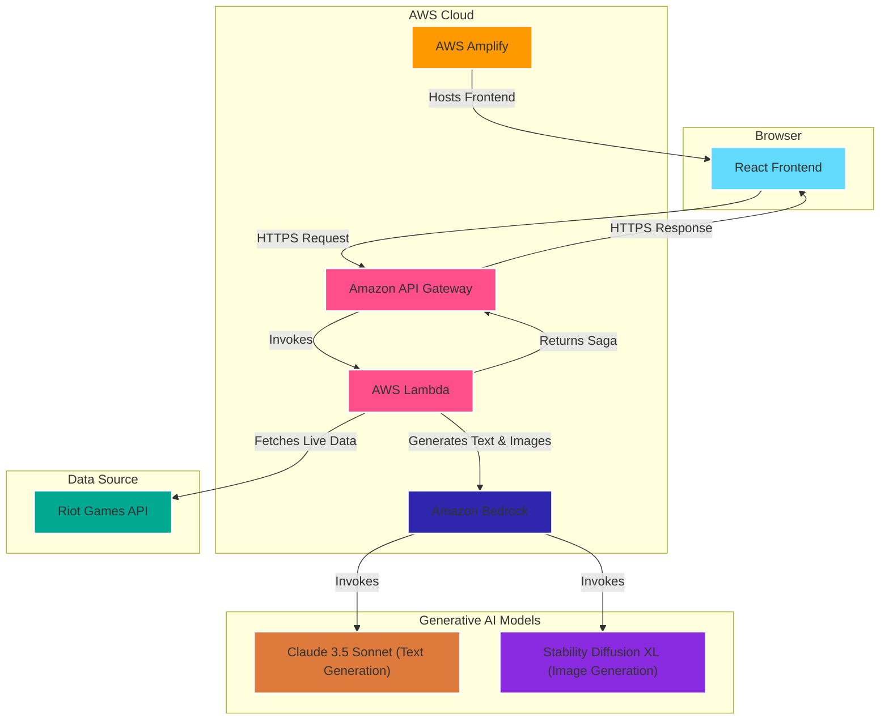

# RiftScribe: Your League of Legends Saga

[](https://opensource.org/licenses/MIT)

**RiftScribe is an AI-powered storytelling agent that transforms a player's raw `League of Legends` match history into a personalized and engaging epic saga. Instead of simply viewing statistics, players can relive their season through a compelling, multi-chapter narrative, complete with AI-generated artwork for each chapter.**

This project was built for the **Rift Rewind Hackathon** and is a fully functional, cloud-native application deployed on AWS.

---

## 🎥 Demo Video

Watch our 3-minute video to see RiftScribe in action and get a full overview of the project's features and technical architecture.

**[Click here to watch the demo video](https://your-video-link-here.com)**

---

## ✨ Features

*   **Personalized Saga Generation:** Transforms your `League of Legends` match history into a unique, multi-chapter story.
*   **AI-Powered Storytellers:** Choose from multiple AI "storyteller" personas inspired by `League of Legends` lore to define the tone and style of your saga.
*   **AI-Generated Artwork:** Each chapter of your saga is accompanied by custom, AI-generated cover art, creating a visually stunning experience.
*   **Data-Driven Narratives:** The AI weaves key insights from your performance—such as most-played champions, best KDA, and arch-nemesis—directly into the story.
*   **Shareable Legend Card:** Generate a beautiful, high-quality summary card of your season, perfect for sharing on social media.

---

## 🏛️ Architecture & Technology Stack

The application is built on a modern, serverless architecture using AWS, ensuring scalability, security, and performance.

### Architectural Diagram



### Technology Stack

*   **Frontend:** Built with React, TypeScript, and Tailwind CSS.
*   **Backend:** Developed as a serverless application using the AWS SAM framework, TypeScript, and Node.js.
*   **AI Models:**
    *   **Amazon Bedrock (Claude 3.5 Sonnet):** Powers the natural language generation for the story.
    *   **Amazon Bedrock (Stability Diffusion XL):** Creates the unique cover art for each chapter.
*   **Cloud Infrastructure:**
    *   **AWS Lambda:** Provides the core serverless compute engine that orchestrates the entire workflow.
    *   **Amazon API Gateway:** Deploys a secure, scalable RESTful API endpoint.
    *   **AWS Amplify:** Hosts the static React frontend and provides a CI/CD pipeline.
*   **Data Source:** Live player data is fetched from the official **Riot Games API**.

---

## 🚀 Deployment

This application is deployed in two parts: the serverless backend on AWS SAM and the React frontend on AWS Amplify.

### Backend Deployment (AWS SAM)

The backend is managed by the AWS Serverless Application Model (SAM).

1.  **Prerequisites:** AWS CLI and SAM CLI installed and configured with AWS credentials. A valid Riot Games API key.
2.  Navigate to the `aws/` directory.
3.  Build the application using the reliable container-based method:
    ```bash
    sam build --use-container
    ```
4.  Deploy the stack using the guided process. You will be prompted to enter your Riot API key securely.
    ```bash
    sam deploy --guided
    ```
5.  After deployment, copy the `RiftScribeApiEndpoint` URL from the command-line outputs.

### Frontend Deployment (AWS Amplify)

The frontend is hosted on AWS Amplify.

1.  Connect this repository to a new AWS Amplify app.
2.  Amplify will automatically detect the build settings from `amplify.yml`.
3.  In the **Environment variables** section, create a new variable:
    *   **Variable:** `VITE_API_ENDPOINT`
    *   **Value:** Paste the `RiftScribeApiEndpoint` URL from the backend deployment.
4.  Save and deploy. Amplify will build and host the site on a global CDN.
