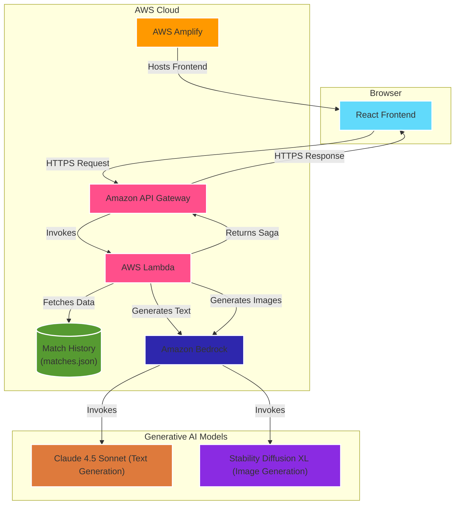

# RiftScribe

**Your League of Legends Season, Forged into Legend.**

---

## 📖 About The Project

RiftScribe is an AI-powered storytelling agent that transforms a player's raw `League of Legends` match history into a personalized and engaging epic saga. Instead of simply viewing statistics, players can relive their season through a compelling, multi-chapter narrative.

The application allows a player to choose a "storyteller" persona—inspired by `League of Legends` lore—which defines the tone and style of their saga. Using a generative AI pipeline on AWS, RiftScribe analyzes player data to extract key insights, such as their most-played champions, greatest victories, and arch-nemesis. It then weaves these insights into a unique story, complete with AI-generated cover art for each chapter.

This project was built for the **Rift Rewind Hackathon** and is a fully functional, cloud-native application.

## 🏛️ Architecture

The application is built on a serverless architecture using AWS services, ensuring scalability, security, and performance. The frontend is decoupled from the backend, communicating via a secure REST API.

## 🛠️ Technology Stack & Data

*   **Amazon Bedrock (Claude 4.5 Sonnet & Stability Diffusion):** Powers the natural language generation of the story and creates unique cover art for each chapter.
*   **Amazon S3:** Stores the input player match history dataset (`matches.json`) that the application reads from to generate a new saga.
*   **AWS Lambda:** Provides the core serverless compute engine. It orchestrates the entire workflow: fetching data from S3, processing it to extract key player insights, calling Bedrock, and returning the final result.
*   **Amazon API Gateway:** Deploys a secure, scalable RESTful API endpoint that allows the frontend application to communicate with the AWS Lambda function.
*   **AWS Amplify:** Hosts the static React frontend and provides a CI/CD pipeline, automatically deploying changes pushed to the source repository.
*   **Data Source:** The player data is derived from a sample file of synthetic game event logs. No private or real-time Riot Games API data was used.
*   **Frontend:** Built with React, TypeScript, and Tailwind CSS.
*   **Backend:** Developed as a serverless application using the AWS SAM framework, TypeScript, and Node.js.

## 🚀 Deployment

This application is deployed in two distinct parts: the serverless backend and the React frontend.

### Backend Deployment (AWS SAM)

The backend is managed by the AWS Serverless Application Model (SAM).

1.  **Prerequisites:** AWS CLI and SAM CLI installed and configured with AWS credentials.
2.  Navigate to the `aws/` directory.
3.  Run `sam build` to compile the Lambda function.
4.  Run `sam deploy --guided` to deploy the stack for the first time. This will create the Lambda function, API Gateway, and necessary IAM roles.
5.  On successful deployment, copy the `RiftScribeApiEndpoint` URL from the command-line outputs.

### Frontend Deployment (AWS Amplify)

The frontend is hosted on AWS Amplify.

1.  Connect this repository to a new AWS Amplify app.
2.  Amplify will automatically detect the build settings from `amplify.yml`.
3.  **Crucially**, in the **Environment variables** section, create a new variable:
    *   **Variable:** `VITE_API_ENDPOINT`
    *   **Value:** Paste the `RiftScribeApiEndpoint` URL from the backend deployment.
4.  Save and deploy. Amplify will build and host the site on a global CDN.
